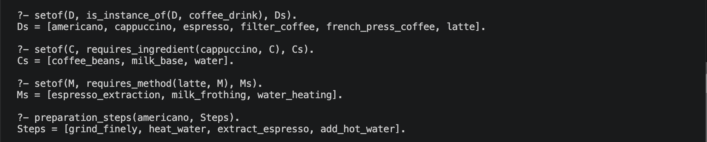
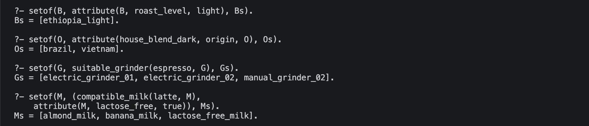
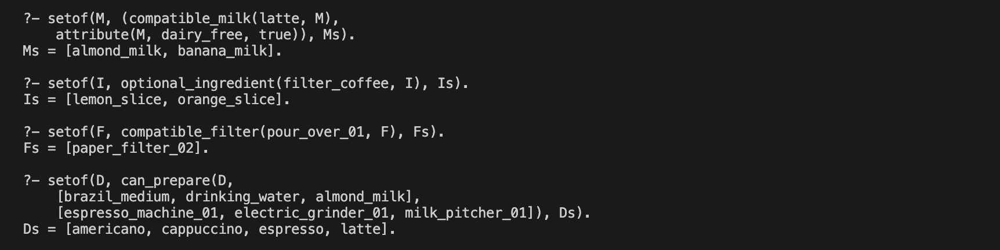
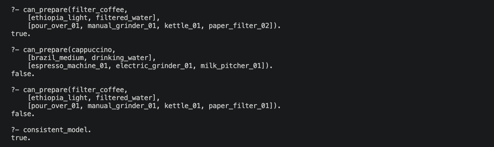
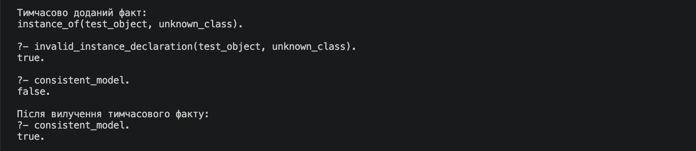
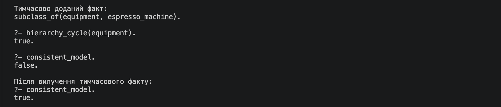
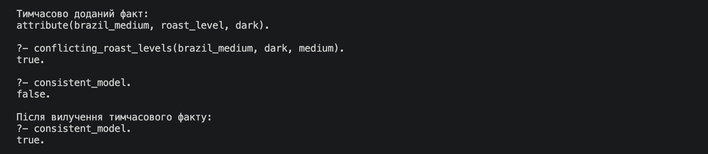
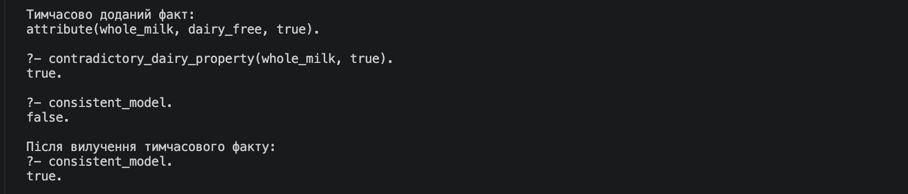

# Лабораторна робота 1

**Виконав** Тимофій ЛЕЙЦИШИН, ТТП-42

**Тема:** Подання знань і бази знань на Пролозі.

## 1 Мета та завдання

**Мета:** набути практичних навичок побудови бази знань предметної області на основі фактів, правил і запитів та аналізу результатів логічного виведення.

**Завдання:** побудувати онтологічну модель області «Кавові напої та їх приготування»; відокремити класи від екземплярів; задати ієрархічні, атрибутивні й асоціативні зв’язки; реалізувати успадкування та перевірки узгодженості; виконати змістовні запити й проаналізувати результати.

## 2 Короткі теоретичні відомості

Факт задає твердження, істинне в межах бази знань. Правило `Head :- Body` визначає умови доведення `Head`. Предикат описує властивість або відношення; його арність дорівнює кількості аргументів. Запит є послідовністю цілей. Логічне виведення використовує уніфікацію, резолюцію та повернення назад для пошуку доведення й перебору альтернатив.

Онтологічна модель явно задає класи, екземпляри, атрибути, відношення й обмеження. Успадкування дозволяє виводити належність екземпляра до надкласів і поширювати вимоги класу на його екземпляри. За підходом закритого світу твердження, яке не задано й не виводиться, залишається недоведеним. Оператор `\+` означає заперечення як невдачу: він успішний, якщо відповідну ціль неможливо довести.

## 3 Предметна область і структура моделі

Модель описує кавові напої, інгредієнти, обладнання та методи приготування. Екземпляри напоїв позначають види напоїв із заданими вимогами до приготування. Списки ресурсів задають їх доступність; кількості інгредієнтів і виконання технологічних операцій не моделюються. `preparation_steps/2` зберігає опис послідовності дій.

### 3.1 Класи та ієрархічні зв’язки

Предикат `class/1` оголошує класи, а `subclass_of/2` задає безпосередні зв’язки підклас–надклас.

| Надклас              | Безпосередні підкласи                                      |
| -------------------- | ---------------------------------------------------------- |
| `coffee_drink`       | `black_coffee`, `milk_coffee`                              |
| `ingredient`         | `coffee_beans`, `water`, `milk_base`, `citrus_ingredient`  |
| `milk_base`          | `dairy_milk`, `plant_based_milk`                           |
| `equipment`          | `brewer`, `grinder`, `kettle`, `milk_frother`, `accessory` |
| `brewer`             | `espresso_machine`, `french_press`, `pour_over_brewer`     |
| `grinder`            | `manual_grinder`, `electric_grinder`                       |
| `accessory`          | `paper_filter`, `milk_pitcher`                             |
| `preparation_method` | `brewing_method`, `supporting_method`                      |

### 3.2 Екземпляри

Безпосередню належність екземпляра до класу задає `instance_of/2`. Належність до надкласів виводить `is_instance_of/2`.

| Безпосередній клас  | Екземпляри                                                      |
| ------------------- | --------------------------------------------------------------- |
| `black_coffee`      | `espresso`, `americano`, `filter_coffee`, `french_press_coffee` |
| `milk_coffee`       | `cappuccino`, `latte`                                           |
| `coffee_beans`      | `brazil_medium`, `ethiopia_light`, `house_blend_dark`           |
| `water`             | `drinking_water`, `filtered_water`                              |
| `dairy_milk`        | `whole_milk`, `lactose_free_milk`                               |
| `plant_based_milk`  | `almond_milk`, `banana_milk`                                    |
| `citrus_ingredient` | `lemon_slice`, `orange_slice`                                   |
| `brewing_method`    | `espresso_extraction`, `gravity_pour_over`, `immersion_brewing` |
| `supporting_method` | `water_heating`, `milk_frothing`                                |
| `espresso_machine`  | `espresso_machine_01`, `espresso_machine_02`                    |
| `french_press`      | `french_press_01`, `french_press_02`                            |
| `pour_over_brewer`  | `pour_over_01`, `pour_over_02`                                  |
| `manual_grinder`    | `manual_grinder_01`, `manual_grinder_02`                        |
| `electric_grinder`  | `electric_grinder_01`, `electric_grinder_02`                    |
| `kettle`            | `kettle_01`, `kettle_02`                                        |
| `milk_frother`      | `milk_frother_01`, `milk_frother_02`                            |
| `paper_filter`      | `paper_filter_01`, `paper_filter_02`                            |
| `milk_pitcher`      | `milk_pitcher_01`, `milk_pitcher_02`                            |

### 3.3 Атрибутивні зв’язки

Факт `attribute(Object, Name, Value)` задає значення атрибута конкретного екземпляра.

| Клас екземпляра                                              | Атрибути                                    | Зміст                                                                                          |
| ------------------------------------------------------------ | ------------------------------------------- | ---------------------------------------------------------------------------------------------- |
| `coffee_drink`                                               | `serving_volume_ml`                         | Об’єм порції в мілілітрах.                                                                     |
| `coffee_beans`                                               | `origin`, `roast_level`, `bean_composition` | Країна походження, ступінь обсмаження та склад зерен. Суміш може мати кілька країн походження. |
| `milk_base`                                                  | `lactose_free`, `dairy_free`, `frothable`   | Ознаки відсутності лактози, відсутності молочних складників і придатності до спінювання.       |
| `plant_based_milk`                                           | `base`                                      | Рослинна основа: мигдаль або банан.                                                            |
| `brewing_method`                                             | `grind_size`                                | Потрібний помел: дрібний, середній або грубий.                                                 |
| `grinder`                                                    | `grind_settings`                            | Список підтримуваних ступенів помелу.                                                          |
| `french_press`, `pour_over_brewer`, `kettle`, `milk_pitcher` | `capacity_ml`                               | Місткість у мілілітрах.                                                                        |
| `pour_over_brewer`, `paper_filter`                           | `filter_shape`, `filter_size`               | Форма й розмір для перевірки сумісності.                                                       |
| `milk_pitcher`                                               | `material`                                  | Матеріал глечика.                                                                              |

Числові атрибути об’єму й місткості є описовими. Значення `frothable = true` стосується саме вибраних екземплярів молочних і рослинних основ.

### 3.4 Асоціативні зв’язки

Усі напої успадковують потребу в зернах, воді та нагріванні води. Капучино й лате також потребують молочної або рослинної основи та спінювання молока. Еспресо, американо, капучино й лате використовують `espresso_extraction`; фільтр-кава використовує `gravity_pour_over`, кава у френч-пресі — `immersion_brewing`.

Еспресо-машини підтримують екстракцію та нагрівання води, чайники — нагрівання, френч-преси — настоювання, пуровери — гравітаційне заварювання, спінювачі — спінювання молока. Пристрій `espresso_machine_01` додатково підтримує спінювання, для якого потребує глечика. Пуровер потребує сумісного паперового фільтра. Лимон і апельсин є необов’язковими додатками до фільтр-кави.

База містить 26 класів, 22 зв’язки підклас–надклас, 40 екземплярів і 172 факти предметної області. Логічне виведення ґрунтується на 17 правилах; програма також містить 15 перевірок узгодженості та 16 прикладів запитів. Кожен клас має щонайменше два екземпляри з урахуванням успадкування; кожен клас із підкласами має щонайменше два безпосередні підкласи.

## 4 Перелік використаних предикатів

### 4.1 Базові предикати

| Предикат                             | Призначення                                               |
| ------------------------------------ | --------------------------------------------------------- |
| `class/1`                            | Оголошує клас.                                            |
| `subclass_of/2`                      | Задає безпосередній зв’язок підклас–надклас.              |
| `instance_of/2`                      | Задає безпосередню належність екземпляра до класу.        |
| `attribute/3`                        | Задає об’єкт, назву атрибута та його значення.            |
| `class_requires_ingredient/2`        | Задає необхідний клас інгредієнтів для класу напоїв.      |
| `class_requires_method/2`            | Задає необхідний метод для класу напоїв.                  |
| `direct_requires_method/2`           | Задає необхідний метод для конкретного напою.             |
| `class_supports_method/2`            | Задає метод, який підтримує клас обладнання.              |
| `direct_supports_method/2`           | Задає метод, який підтримує конкретний пристрій.          |
| `class_requires_accessory/2`         | Задає необхідний клас аксесуарів для класу обладнання.    |
| `direct_requires_method_accessory/3` | Задає потрібний аксесуар для методу конкретного пристрою. |
| `optional_ingredient/2`              | Задає необов’язковий інгредієнт напою.                    |
| `preparation_steps/2`                | Задає впорядкований список дій приготування.              |

### 4.2 Предикати логічного виведення

| Предикат                | Призначення                                                              |
| ----------------------- | ------------------------------------------------------------------------ |
| `class_path/3`          | Шукає шлях в ієрархії з обліком відвіданих класів.                       |
| `is_subclass_of/2`      | Виводить транзитивний зв’язок підклас–надклас; виключає рівність класів. |
| `is_instance_of/2`      | Виводить безпосередню та успадковану належність екземпляра.              |
| `requires_ingredient/2` | Виводить необхідні класи інгредієнтів напою.                             |
| `requires_method/2`     | Об’єднує безпосередні й успадковані вимоги до методів.                   |
| `supports_method/2`     | Об’єднує безпосередні й успадковані можливості пристрою.                 |
| `requires_accessory/3`  | Виводить потрібний клас аксесуарів для пристрою й методу.                |
| `required_grind/2`      | Виводить помел із методу заварювання напою.                              |
| `suitable_grinder/2`    | Знаходить кавомолку, яка підтримує потрібний помел.                      |
| `compatible_milk/2`     | Знаходить молочну або рослинну основу з урахуванням спінювання.          |
| `compatible_filter/2`   | Перевіряє збіг форми й розміру пристрою та фільтра.                      |
| `method_available/2`    | Знаходить пристрій і потрібні аксесуари в списку обладнання.             |
| `can_prepare/3`         | Перевіряє доступність інгредієнтів, помелу та всіх потрібних методів.    |

### 4.3 Предикати перевірки узгодженості

| Предикат                         | Призначення                                                                    |
| -------------------------------- | ------------------------------------------------------------------------------ |
| `disjoint_class/2`               | Задає пару несумісних класів.                                                  |
| `invalid_class_name/1`           | Виявляє назву класу, яка не є атомом.                                          |
| `class_instance_collision/1`     | Виявляє використання однієї назви для класу й екземпляра.                      |
| `invalid_subclass_relation/2`    | Виявляє незаповнені аргументи або невідомі класи в ієрархічному зв’язку.       |
| `invalid_instance_declaration/2` | Виявляє некоректну назву екземпляра, незаповнені аргументи або невідомий клас. |
| `invalid_equipment_method/2`     | Виявляє порушення типів аргументів безпосередньої підтримки методу.            |
| `hierarchy_cycle/1`              | Виявляє цикл в ієрархії класів.                                                |
| `multiple_direct_classes/2`      | Виявляє більше одного безпосереднього класу екземпляра.                        |
| `incompatible_membership/3`      | Виявляє належність екземпляра до несумісних класів.                            |
| `invalid_roast_level/2`          | Виявляє неприпустимий ступінь обсмаження або неналежний об’єкт атрибута.       |
| `missing_roast_level/1`          | Виявляє відсутність ступеня обсмаження зерен.                                  |
| `conflicting_roast_levels/3`     | Виявляє два різні значення ступеня обсмаження одного об’єкта.                  |
| `invalid_brewing_method_count/2` | Виявляє кількість методів заварювання напою, відмінну від одного.              |
| `missing_preparation_steps/1`    | Виявляє відсутність опису приготування напою.                                  |
| `unsupported_accessory_method/2` | Виявляє вимогу аксесуара для методу, який пристрій не підтримує.               |
| `contradictory_dairy_property/2` | Виявляє значення `dairy_free`, відмінне від `false`, для молочного продукту.   |
| `consistent_model/0`             | Успішний, якщо жодна з реалізованих перевірок не виявляє помилки.              |

### 4.4 Приклади запитів

| Предикат          | Призначення                                                   |
| ----------------- | ------------------------------------------------------------- |
| `example_query/2` | Зберігає назву прикладу та ціль для виконання через `call/1`. |

Стандартні предикати `member/2` і `memberchk/2` використовуються для роботи зі списками, `dif/2` задає нерівність термів. `forall/2` перевіряє всі вимоги, `once/1` залишає одне доведення наявності придатної кавомолки. У `can_prepare/3` списки інгредієнтів і обладнання мають бути повністю визначеними; аргумент напою може бути змінною.

## 5 Базові та похідні знання

Базовими є явно задані факти про класи, екземпляри, атрибути, безпосередні вимоги напоїв і можливості обладнання. Похідними є належність до надкласів, успадковані вимоги, сумісність ресурсів і можливість приготування.

Приклад базових фактів:

```prolog
instance_of(manual_grinder_01, manual_grinder).
subclass_of(manual_grinder, grinder).
subclass_of(grinder, equipment).
```

За цим ланцюгом `is_instance_of/2` виводить належність кавомолки до класу обладнання:

```prolog
?- is_instance_of(manual_grinder_01, equipment).
true.
```

Належність кавомолки до `equipment` виводиться без окремого факту `instance_of(manual_grinder_01, equipment)`. Аналогічно потреба капучино в зернах і воді виводиться через його належність до `coffee_drink`, а потреба в молочній основі — через `milk_coffee`.

## 6 Запити, результати та аналіз

Середовище виконання: SWI-Prolog 10.0.2 (macOS, arm64). Результати запитів стосуються початкової бази знань.

### 6.1 Належність напоїв до надкласу

```prolog
?- setof(D, is_instance_of(D, coffee_drink), Ds).
Ds = [americano, cappuccino, espresso, filter_coffee, french_press_coffee, latte].
```

**Аналіз:** Результат містить усі шість напоїв: їх належність до `coffee_drink` виводиться через підкласи `black_coffee` та `milk_coffee`.

### 6.2 Успадковані вимоги капучино

```prolog
?- setof(C, requires_ingredient(cappuccino, C), Cs).
Cs = [coffee_beans, milk_base, water].
```

**Аналіз:** Зерна й вода потрібні за вимогами `coffee_drink`, молочна основа — за вимогою `milk_coffee`.

### 6.3 Методи приготування лате

```prolog
?- setof(M, requires_method(latte, M), Ms).
Ms = [espresso_extraction, milk_frothing, water_heating].
```

**Аналіз:** Екстракція та спінювання є безпосередніми вимогами лате; нагрівання води успадковується від `coffee_drink`.

### 6.4 Послідовність приготування американо

```prolog
?- preparation_steps(americano, Steps).
Steps = [grind_finely, heat_water, extract_espresso, add_hot_water].
```

**Аналіз:** Після екстракції еспресо додається гаряча вода; список дій визначає порядок операцій.



### 6.5 Зерна зі світлим обсмаженням

```prolog
?- setof(B, attribute(B, roast_level, light), Bs).
Bs = [ethiopia_light].
```

**Аналіз:** Лише `ethiopia_light` має значення `light` атрибута `roast_level`.

### 6.6 Країни походження суміші

```prolog
?- setof(O, attribute(house_blend_dark, origin, O), Os).
Os = [brazil, vietnam].
```

**Аналіз:** Два факти `origin` задають Бразилію та В’єтнам як країни походження суміші; це допустима багатозначність атрибута.

### 6.7 Кавомолки для еспресо

```prolog
?- setof(G, suitable_grinder(espresso, G), Gs).
Gs = [electric_grinder_01, electric_grinder_02, manual_grinder_02].
```

**Аналіз:** Екстракція еспресо потребує дрібного помелу. `manual_grinder_01` не належить до результату, оскільки підтримує лише середній і грубий помел.

### 6.8 Безлактозні основи для лате

```prolog
?- setof(M, (compatible_milk(latte, M),
    attribute(M, lactose_free, true)), Ms).
Ms = [almond_milk, banana_milk, lactose_free_milk].
```

**Аналіз:** Усі три основи мають `lactose_free = true` і придатні до спінювання; звичайне молоко не задовольняє першу умову.



### 6.9 Рослинні основи для лате

```prolog
?- setof(M, (compatible_milk(latte, M),
    attribute(M, dairy_free, true)), Ms).
Ms = [almond_milk, banana_milk].
```

**Аналіз:** Результат містить дві рослинні основи. Безлактозне молоко не задовольняє умову, оскільки його `dairy_free = false`.

### 6.10 Необов’язкові додатки до фільтр-кави

```prolog
?- setof(I, optional_ingredient(filter_coffee, I), Is).
Is = [lemon_slice, orange_slice].
```

**Аналіз:** Лимон і апельсин дозволені як необов’язкові додатки; їх наявність не є умовою приготування.

### 6.11 Сумісний фільтр для пуровера

```prolog
?- setof(F, compatible_filter(pour_over_01, F), Fs).
Fs = [paper_filter_02].
```

**Аналіз:** Форма обох фільтрів конічна, але розміру `pour_over_01` відповідає лише `paper_filter_02`.

### 6.12 Напої з доступних ресурсів

```prolog
?- setof(D, can_prepare(D,
    [brazil_medium, drinking_water, almond_milk],
    [espresso_machine_01, electric_grinder_01, milk_pitcher_01]), Ds).
Ds = [americano, cappuccino, espresso, latte].
```

**Аналіз:** Для чотирьох напоїв доступні потрібні інгредієнти, помел і методи. Для фільтр-кави та кави у френч-пресі відсутні відповідні пристрої заварювання.



### 6.13 Фільтр-кава без лимона

```prolog
?- can_prepare(filter_coffee,
    [ethiopia_light, filtered_water],
    [pour_over_01, manual_grinder_01, kettle_01, paper_filter_02]).
true.
```

**Аналіз:** Наявні всі обов’язкові ресурси та сумісний фільтр; лимон не потрібний для доведення цілі.

### 6.14 Капучино без молочної або рослинної основи

```prolog
?- can_prepare(cappuccino,
    [brazil_medium, drinking_water],
    [espresso_machine_01, electric_grinder_01, milk_pitcher_01]).
false.
```

**Аналіз:** Ціль не доводиться через відсутність молочної або рослинної основи, обов’язкової для капучино.

### 6.15 Фільтр-кава з несумісним фільтром

```prolog
?- can_prepare(filter_coffee,
    [ethiopia_light, filtered_water],
    [pour_over_01, manual_grinder_01, kettle_01, paper_filter_01]).
false.
```

**Аналіз:** Розмір `paper_filter_01` дорівнює 1, а пристрій `pour_over_01` потребує розміру 2.

### 6.16 Узгодженість початкової моделі

```prolog
?- consistent_model.
true.
```

**Аналіз:** Початкова модель задовольняє всі реалізовані обмеження узгодженості.



## 7 Приклади перевірок узгодженості

Кожен приклад містить окремий тимчасовий факт, що порушує узгодженість початкової моделі, відповідний запит і результат. Додавання факту здійснюється через `assertz/2`, вилучення — через `erase/1`. За наявності такого факту `consistent_model` повертає `false`, без нього — `true`.

### 7.1 Невідомий клас

```prolog
instance_of(test_object, unknown_class).
?- invalid_instance_declaration(test_object, unknown_class).
true.
```

Екземпляр посилається на неоголошений клас.



### 7.2 Цикл у ієрархії

```prolog
subclass_of(equipment, espresso_machine).
?- hierarchy_cycle(equipment).
true.
```

Зворотний зв’язок замикає шлях `espresso_machine` → `brewer` → `equipment`.



### 7.3 Суперечливий атрибут

```prolog
attribute(brazil_medium, roast_level, dark).
?- conflicting_roast_levels(brazil_medium, dark, medium).
true.
```

Один об’єкт має різні значення ступеня обсмаження.



### 7.4 Суперечлива властивість молока

```prolog
attribute(whole_milk, dairy_free, true).
?- contradictory_dairy_property(whole_milk, true).
true.
```

Значення `dairy_free = true` суперечить належності об’єкта до класу `dairy_milk`.



## 8 Помилка під час розроблення та її усунення

Помилка автоматичного завантаження `dif/2` у тестовому середовищі усувається явним підключенням стандартної бібліотеки:

```prolog
:- use_module(library(dif), [dif/2]).
```

## 9 Висновки

База знань виводить належність до надкласів, успадковані вимоги та можливість приготування за доступними ресурсами. Результати 16 запитів відповідають заданим фактам і правилам; початкова модель задовольняє реалізовані обмеження, а перевірки виявляють усі чотири контрольні помилки.

Уніфікація та повернення назад забезпечують перебір відповідей, а транзитивне успадкування усуває потребу дублювати належність до надкласів у фактах. У межах закритого світу відсутність потрібного ресурсу перешкоджає доведенню можливості приготування. Облік відвіданих класів забезпечує завершення пошуку за наявності циклу.

## Додаток А. Повний текст програми

Посилання <https://github.com/leitsyshyn/is/tree/main/lab-1>

Файл `brew.pl`.

```prolog
:- use_module(library(lists), [member/2, memberchk/2]).
:- use_module(library(dif), [dif/2]).

:- dynamic class/1, subclass_of/2, instance_of/2, attribute/3,
    class_requires_ingredient/2, class_requires_method/2,
    direct_requires_method/2, class_supports_method/2,
    direct_supports_method/2, class_requires_accessory/2,
    direct_requires_method_accessory/3, optional_ingredient/2,
    preparation_steps/2.

class(coffee_drink).
class(black_coffee).
class(milk_coffee).
class(ingredient).
class(coffee_beans).
class(water).
class(milk_base).
class(dairy_milk).
class(plant_based_milk).
class(citrus_ingredient).
class(equipment).
class(brewer).
class(espresso_machine).
class(french_press).
class(pour_over_brewer).
class(grinder).
class(manual_grinder).
class(electric_grinder).
class(kettle).
class(milk_frother).
class(accessory).
class(paper_filter).
class(milk_pitcher).
class(preparation_method).
class(brewing_method).
class(supporting_method).

subclass_of(black_coffee, coffee_drink).
subclass_of(milk_coffee, coffee_drink).
subclass_of(coffee_beans, ingredient).
subclass_of(water, ingredient).
subclass_of(milk_base, ingredient).
subclass_of(dairy_milk, milk_base).
subclass_of(plant_based_milk, milk_base).
subclass_of(citrus_ingredient, ingredient).
subclass_of(brewer, equipment).
subclass_of(espresso_machine, brewer).
subclass_of(french_press, brewer).
subclass_of(pour_over_brewer, brewer).
subclass_of(grinder, equipment).
subclass_of(manual_grinder, grinder).
subclass_of(electric_grinder, grinder).
subclass_of(kettle, equipment).
subclass_of(milk_frother, equipment).
subclass_of(accessory, equipment).
subclass_of(paper_filter, accessory).
subclass_of(milk_pitcher, accessory).
subclass_of(brewing_method, preparation_method).
subclass_of(supporting_method, preparation_method).

instance_of(espresso, black_coffee).
instance_of(americano, black_coffee).
instance_of(cappuccino, milk_coffee).
instance_of(latte, milk_coffee).
instance_of(filter_coffee, black_coffee).
instance_of(french_press_coffee, black_coffee).
instance_of(brazil_medium, coffee_beans).
instance_of(ethiopia_light, coffee_beans).
instance_of(house_blend_dark, coffee_beans).
instance_of(drinking_water, water).
instance_of(filtered_water, water).
instance_of(whole_milk, dairy_milk).
instance_of(lactose_free_milk, dairy_milk).
instance_of(almond_milk, plant_based_milk).
instance_of(banana_milk, plant_based_milk).
instance_of(lemon_slice, citrus_ingredient).
instance_of(orange_slice, citrus_ingredient).
instance_of(espresso_extraction, brewing_method).
instance_of(gravity_pour_over, brewing_method).
instance_of(immersion_brewing, brewing_method).
instance_of(water_heating, supporting_method).
instance_of(milk_frothing, supporting_method).
instance_of(espresso_machine_01, espresso_machine).
instance_of(espresso_machine_02, espresso_machine).
instance_of(french_press_01, french_press).
instance_of(french_press_02, french_press).
instance_of(pour_over_01, pour_over_brewer).
instance_of(pour_over_02, pour_over_brewer).
instance_of(manual_grinder_01, manual_grinder).
instance_of(manual_grinder_02, manual_grinder).
instance_of(electric_grinder_01, electric_grinder).
instance_of(electric_grinder_02, electric_grinder).
instance_of(kettle_01, kettle).
instance_of(kettle_02, kettle).
instance_of(milk_frother_01, milk_frother).
instance_of(milk_frother_02, milk_frother).
instance_of(paper_filter_01, paper_filter).
instance_of(paper_filter_02, paper_filter).
instance_of(milk_pitcher_01, milk_pitcher).
instance_of(milk_pitcher_02, milk_pitcher).

attribute(espresso, serving_volume_ml, 30).
attribute(americano, serving_volume_ml, 150).
attribute(cappuccino, serving_volume_ml, 180).
attribute(latte, serving_volume_ml, 250).
attribute(filter_coffee, serving_volume_ml, 250).
attribute(french_press_coffee, serving_volume_ml, 250).
attribute(brazil_medium, origin, brazil).
attribute(brazil_medium, roast_level, medium).
attribute(brazil_medium, bean_composition, [arabica]).
attribute(ethiopia_light, origin, ethiopia).
attribute(ethiopia_light, roast_level, light).
attribute(ethiopia_light, bean_composition, [arabica]).
attribute(house_blend_dark, origin, brazil).
attribute(house_blend_dark, origin, vietnam).
attribute(house_blend_dark, roast_level, dark).
attribute(house_blend_dark, bean_composition, [arabica, robusta]).
attribute(whole_milk, lactose_free, false).
attribute(whole_milk, dairy_free, false).
attribute(whole_milk, frothable, true).
attribute(lactose_free_milk, lactose_free, true).
attribute(lactose_free_milk, dairy_free, false).
attribute(lactose_free_milk, frothable, true).
attribute(almond_milk, base, almond).
attribute(almond_milk, lactose_free, true).
attribute(almond_milk, dairy_free, true).
attribute(almond_milk, frothable, true).
attribute(banana_milk, base, banana).
attribute(banana_milk, lactose_free, true).
attribute(banana_milk, dairy_free, true).
attribute(banana_milk, frothable, true).
attribute(espresso_extraction, grind_size, fine).
attribute(gravity_pour_over, grind_size, medium).
attribute(immersion_brewing, grind_size, coarse).
attribute(french_press_01, capacity_ml, 600).
attribute(french_press_02, capacity_ml, 350).
attribute(pour_over_01, capacity_ml, 500).
attribute(pour_over_01, filter_shape, conical).
attribute(pour_over_01, filter_size, 2).
attribute(pour_over_02, capacity_ml, 300).
attribute(pour_over_02, filter_shape, conical).
attribute(pour_over_02, filter_size, 1).
attribute(manual_grinder_01, grind_settings, [medium, coarse]).
attribute(manual_grinder_02, grind_settings, [fine, medium, coarse]).
attribute(electric_grinder_01, grind_settings, [fine, medium, coarse]).
attribute(electric_grinder_02, grind_settings, [fine, medium]).
attribute(kettle_01, capacity_ml, 1000).
attribute(kettle_02, capacity_ml, 600).
attribute(paper_filter_01, filter_shape, conical).
attribute(paper_filter_01, filter_size, 1).
attribute(paper_filter_02, filter_shape, conical).
attribute(paper_filter_02, filter_size, 2).
attribute(milk_pitcher_01, capacity_ml, 350).
attribute(milk_pitcher_01, material, stainless_steel).
attribute(milk_pitcher_02, capacity_ml, 600).
attribute(milk_pitcher_02, material, stainless_steel).

class_requires_ingredient(coffee_drink, coffee_beans).
class_requires_ingredient(coffee_drink, water).
class_requires_ingredient(milk_coffee, milk_base).

class_requires_method(coffee_drink, water_heating).

direct_requires_method(espresso, espresso_extraction).
direct_requires_method(americano, espresso_extraction).
direct_requires_method(cappuccino, espresso_extraction).
direct_requires_method(cappuccino, milk_frothing).
direct_requires_method(latte, espresso_extraction).
direct_requires_method(latte, milk_frothing).
direct_requires_method(filter_coffee, gravity_pour_over).
direct_requires_method(french_press_coffee, immersion_brewing).

class_supports_method(espresso_machine, espresso_extraction).
class_supports_method(espresso_machine, water_heating).
class_supports_method(french_press, immersion_brewing).
class_supports_method(pour_over_brewer, gravity_pour_over).
class_supports_method(kettle, water_heating).
class_supports_method(milk_frother, milk_frothing).

direct_supports_method(espresso_machine_01, milk_frothing).

class_requires_accessory(pour_over_brewer, paper_filter).

direct_requires_method_accessory(espresso_machine_01, milk_frothing, milk_pitcher).

optional_ingredient(filter_coffee, lemon_slice).
optional_ingredient(filter_coffee, orange_slice).

preparation_steps(espresso,
    [grind_finely, heat_water, extract_espresso]).
preparation_steps(americano,
    [grind_finely, heat_water, extract_espresso, add_hot_water]).
preparation_steps(cappuccino,
    [grind_finely, heat_water, extract_espresso, froth_milk, combine_milk_and_foam]).
preparation_steps(latte,
    [grind_finely, heat_water, extract_espresso, froth_milk, add_milk_and_thin_foam]).
preparation_steps(filter_coffee,
    [grind_medium, heat_water, place_filter, add_grounds, pour_water, optionally_add_citrus]).
preparation_steps(french_press_coffee,
    [grind_coarsely, heat_water, add_grounds_and_water, steep, press_plunger, pour]).

is_subclass_of(Child, Ancestor) :-
    class_path(Child, Ancestor, [Child]),
    dif(Child, Ancestor).

class_path(Child, Ancestor, _) :-
    subclass_of(Child, Ancestor).
class_path(Child, Ancestor, Visited) :-
    subclass_of(Child, Parent),
    \+ memberchk(Parent, Visited),
    class_path(Parent, Ancestor, [Parent | Visited]).

is_instance_of(Object, Class) :-
    instance_of(Object, Class).
is_instance_of(Object, Class) :-
    instance_of(Object, DirectClass),
    is_subclass_of(DirectClass, Class).

requires_ingredient(Drink, IngredientClass) :-
    is_instance_of(Drink, Class),
    class_requires_ingredient(Class, IngredientClass).

requires_method(Drink, Method) :-
    direct_requires_method(Drink, Method).
requires_method(Drink, Method) :-
    is_instance_of(Drink, Class),
    class_requires_method(Class, Method).

supports_method(Device, Method) :-
    direct_supports_method(Device, Method).
supports_method(Device, Method) :-
    is_instance_of(Device, Class),
    class_supports_method(Class, Method).

requires_accessory(Device, Method, AccessoryClass) :-
    supports_method(Device, Method),
    (   is_instance_of(Device, Class),
        class_requires_accessory(Class, AccessoryClass)
    ;   direct_requires_method_accessory(Device, Method, AccessoryClass)
    ).

required_grind(Drink, Grind) :-
    requires_method(Drink, Method),
    is_instance_of(Method, brewing_method),
    attribute(Method, grind_size, Grind).

suitable_grinder(Drink, Grinder) :-
    required_grind(Drink, Grind),
    is_instance_of(Grinder, grinder),
    attribute(Grinder, grind_settings, Settings),
    memberchk(Grind, Settings).

compatible_milk(Drink, Milk) :-
    requires_ingredient(Drink, milk_base),
    is_instance_of(Milk, milk_base),
    (   requires_method(Drink, milk_frothing)
    ->  attribute(Milk, frothable, true)
    ;   true
    ).

compatible_filter(Brewer, Filter) :-
    is_instance_of(Brewer, pour_over_brewer),
    is_instance_of(Filter, paper_filter),
    attribute(Brewer, filter_shape, Shape),
    attribute(Filter, filter_shape, Shape),
    attribute(Brewer, filter_size, Size),
    attribute(Filter, filter_size, Size).

method_available(Method, Equipment) :-
    member(Device, Equipment),
    supports_method(Device, Method),
    forall(requires_accessory(Device, Method, Class),
        (   member(Accessory, Equipment),
            is_instance_of(Accessory, Class),
            (   Class == paper_filter
            ->  compatible_filter(Device, Accessory)
            ;   true
            )
        )).

can_prepare(Drink, Ingredients, Equipment) :-
    ground(Ingredients-Equipment),
    is_list(Ingredients),
    is_list(Equipment),
    forall(member(Ingredient, Ingredients), is_instance_of(Ingredient, ingredient)),
    forall(member(Device, Equipment), is_instance_of(Device, equipment)),
    is_instance_of(Drink, coffee_drink),
    forall(requires_ingredient(Drink, Class),
        (   member(Ingredient, Ingredients),
            is_instance_of(Ingredient, Class),
            (   Class == milk_base
            ->  compatible_milk(Drink, Ingredient)
            ;   true
            )
        )),
    once((member(Grinder, Equipment), suitable_grinder(Drink, Grinder))),
    forall(requires_method(Drink, Method), method_available(Method, Equipment)).

disjoint_class(black_coffee, milk_coffee).
disjoint_class(dairy_milk, plant_based_milk).

invalid_class_name(Class) :-
    class(Class),
    \+ atom(Class).

class_instance_collision(Object) :-
    class(Object),
    instance_of(Object, _).

invalid_subclass_relation(Child, Parent) :-
    subclass_of(Child, Parent),
    \+ (ground(Child-Parent), class(Child), class(Parent)).

invalid_instance_declaration(Object, Class) :-
    instance_of(Object, Class),
    \+ (ground(Object-Class), atom(Object), class(Class)).

invalid_equipment_method(Device, Method) :-
    direct_supports_method(Device, Method),
    \+ (   ground(Device-Method),
           is_instance_of(Device, equipment),
           is_instance_of(Method, preparation_method)
       ).

hierarchy_cycle(Class) :-
    class(Class),
    class_path(Class, Class, [Class]).

multiple_direct_classes(Object, Classes) :-
    setof(Class, instance_of(Object, Class), Classes),
    Classes = [_, _ | _].

incompatible_membership(Object, First, Second) :-
    disjoint_class(First, Second),
    is_instance_of(Object, First),
    is_instance_of(Object, Second).

invalid_roast_level(Beans, Level) :-
    attribute(Beans, roast_level, Level),
    \+ (   ground(Beans-Level),
           is_instance_of(Beans, coffee_beans),
           memberchk(Level, [light, medium, dark])
       ).

missing_roast_level(Beans) :-
    is_instance_of(Beans, coffee_beans),
    \+ attribute(Beans, roast_level, _).

conflicting_roast_levels(Beans, First, Second) :-
    attribute(Beans, roast_level, First),
    attribute(Beans, roast_level, Second),
    First @< Second.

invalid_brewing_method_count(Drink, Methods) :-
    is_instance_of(Drink, coffee_drink),
    findall(Method,
        (requires_method(Drink, Method), is_instance_of(Method, brewing_method)),
        Found),
    sort(Found, Methods),
    Methods \= [_].

missing_preparation_steps(Drink) :-
    is_instance_of(Drink, coffee_drink),
    \+ preparation_steps(Drink, _).

unsupported_accessory_method(Device, Method) :-
    direct_requires_method_accessory(Device, Method, _),
    \+ supports_method(Device, Method).

contradictory_dairy_property(Milk, Value) :-
    is_instance_of(Milk, dairy_milk),
    attribute(Milk, dairy_free, Value),
    Value \== false.

consistent_model :-
    \+ invalid_class_name(_),
    \+ class_instance_collision(_),
    \+ invalid_subclass_relation(_, _),
    \+ invalid_instance_declaration(_, _),
    \+ invalid_equipment_method(_, _),
    \+ hierarchy_cycle(_),
    \+ multiple_direct_classes(_, _),
    \+ incompatible_membership(_, _, _),
    \+ invalid_roast_level(_, _),
    \+ missing_roast_level(_),
    \+ conflicting_roast_levels(_, _, _),
    \+ invalid_brewing_method_count(_, _),
    \+ missing_preparation_steps(_),
    \+ unsupported_accessory_method(_, _),
    \+ contradictory_dairy_property(_, _).

example_query(drinks,
    setof(Drink, is_instance_of(Drink, coffee_drink), _)).
example_query(cappuccino_ingredients,
    setof(Class, requires_ingredient(cappuccino, Class), _)).
example_query(latte_methods,
    setof(Method, requires_method(latte, Method), _)).
example_query(americano_steps,
    preparation_steps(americano, _)).
example_query(light_roast,
    setof(Beans, attribute(Beans, roast_level, light), _)).
example_query(blend_origins,
    setof(Origin, attribute(house_blend_dark, origin, Origin), _)).
example_query(espresso_grinders,
    setof(Grinder, suitable_grinder(espresso, Grinder), _)).
example_query(lactose_free_latte_options,
    setof(Milk, (compatible_milk(latte, Milk), attribute(Milk, lactose_free, true)), _)).
example_query(dairy_free_latte_options,
    setof(Milk, (compatible_milk(latte, Milk), attribute(Milk, dairy_free, true)), _)).
example_query(filter_additions,
    setof(Ingredient, optional_ingredient(filter_coffee, Ingredient), _)).
example_query(matching_filters,
    setof(Filter, compatible_filter(pour_over_01, Filter), _)).
example_query(available_drinks,
    setof(Drink,
        can_prepare(Drink,
            [brazil_medium, drinking_water, almond_milk],
            [espresso_machine_01, electric_grinder_01, milk_pitcher_01]),
        _)).
example_query(filter_without_lemon,
    can_prepare(filter_coffee,
        [ethiopia_light, filtered_water],
        [pour_over_01, manual_grinder_01, kettle_01, paper_filter_02])).
example_query(missing_milk,
    can_prepare(cappuccino,
        [brazil_medium, drinking_water],
        [espresso_machine_01, electric_grinder_01, milk_pitcher_01])).
example_query(wrong_filter,
    can_prepare(filter_coffee,
        [ethiopia_light, filtered_water],
        [pour_over_01, manual_grinder_01, kettle_01, paper_filter_01])).
example_query(model_consistency,
    consistent_model).
```
